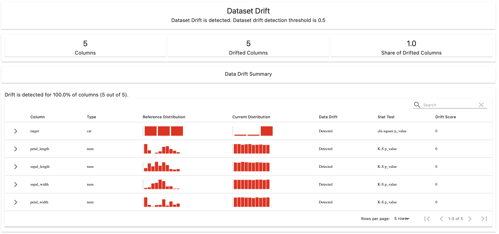

# fastdrift

Basic FastAPI application with built-in data drift detection using Evidently AI.

## How to use?

1. Install the required packages defined in the `pyproject.toml` in a virtual environment.
2. Run the `trainer.py` script to save the scikit-learn model and reference dataset in the `resources` directory.
3. Use Locust to create the predictions SQLite database: `make locust-start`.
4. Start the FastAPI server: `make fastdrift-start`. 
5. Open your web browser and navigate to the API monitoring endpoint: <http://localhost:8000/monitoring>.

## Result

